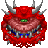
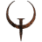

# ToaruOS third-party icons

This repository contains icons for third-party software for ToaruOS. You can clone this repository into `hdd/usr/share/icons/external` in your ToaruOS checkout to use them. They are separated from the core repository as the software they are for is not shipped by default, and much of it is proprietary or conflictingly licensed to the rest of the ToaruOS codebase. As more software is ported to ToaruOS, more icons will be added to this repository.

These icons come from various sources and have very different licensing terms, so pay attention:

Icon | Name | Application | Source
:--: | :--: | :---------: | ------
 | `prboom 2.5.0` | Doom | sourced from [here](http://www.trilobite.org/doom/cacodemon.html), derived from the original texture for the Cacodemon from the games
 | `sdlquake` | Quake | sourced from [here](http://www.iconarchive.com/show/game-icons-by-th3-prophetman/Quake-icon.html), released by its author [under the CC BY-NC-SA 3.0 license](http://moskis.net/extra/icons/readme-en/)
 | `pdfviewer` | muPDF | sourced from the muPDF website. MuPDF is Copyright 2006-2015 Artifex Software, Inc.
